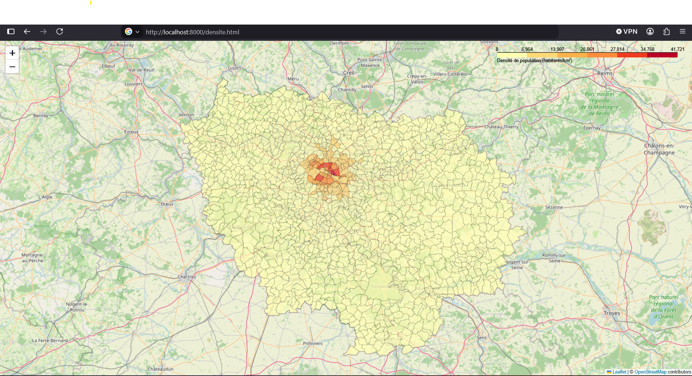

# Geospatial Data Analysis 🗺️

A Python project exploring geospatial data processing, geocoding and interactive mapping using OpenStreetMap, Folium, GeoJSON and French public datasets.

## 📌 Project Overview

This project explores several techniques for working with geographic data in Python.

The objective is to retrieve, process and visualize geospatial information through interactive maps. The project combines geographic coordinates, GeoJSON files and public datasets to create different map-based visualizations.

## 🗺️ Population Density Visualization

The map below shows population density across municipalities in the Île-de-France region. The visualization combines geographic boundaries with population and surface-area data to highlight spatial differences in population density.

## 🛠️ Technologies Used

- Python
- Pandas
- Folium
- OpenStreetMap
- GeoJSON
- Geocoding
- INSEE public data
- HTML
- Git & GitHub

## 🌍 Main Features

### 📍 Geocoding

Convert addresses or locations into geographic coordinates that can be displayed on a map.

### 🔄 Reverse Geocoding

Convert geographic coordinates back into human-readable location information.

### 🗺️ Interactive Maps

Generate interactive HTML maps using Folium and OpenStreetMap.

### 🎨 Choropleth Maps

Create choropleth maps to represent statistical information geographically.

### 👥 Population Density Analysis

Combine French geographic and INSEE population data to calculate and visualize population density across areas of Île-de-France.

### 🌦️ Geographic & Weather Data

Explore geographic visualization using weather-related datasets.

## 📂 Project Structure

    geospatial-data-analysis/
    │
    ├── carte.py
    ├── carte_idf.py
    ├── geocoding.py
    ├── reverse_geocoding.py
    ├── geojson.py
    ├── choroplethe.py
    ├── exercice_densite.py
    ├── meteo.py
    │
    ├── *.geojson
    ├── *.json
    ├── *.csv
    │
    ├── *.html
    ├── .gitignore
    └── README.md

## 📊 Data Visualization

The project generates interactive HTML maps that can be opened directly in a web browser.

These visualizations make it possible to explore geographic information dynamically instead of relying only on static tables or numerical data.

## 🧠 What I Learned

Through this project, I practiced:

- Manipulating geographic data with Python
- Working with latitude and longitude coordinates
- Using OpenStreetMap data
- Creating interactive maps with Folium
- Reading and manipulating GeoJSON files
- Performing geocoding and reverse geocoding
- Combining geographic and statistical datasets
- Calculating population density
- Creating choropleth visualizations
- Working with French public datasets
- Structuring a geospatial Python project

## 👩‍💻 Author

Engineering student specializing in Data Science & Artificial Intelligence.